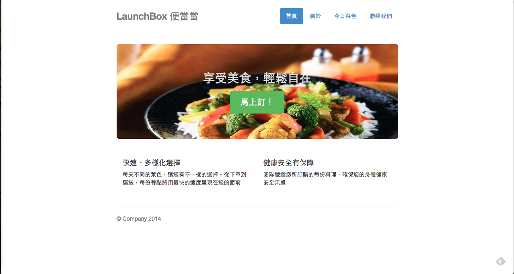
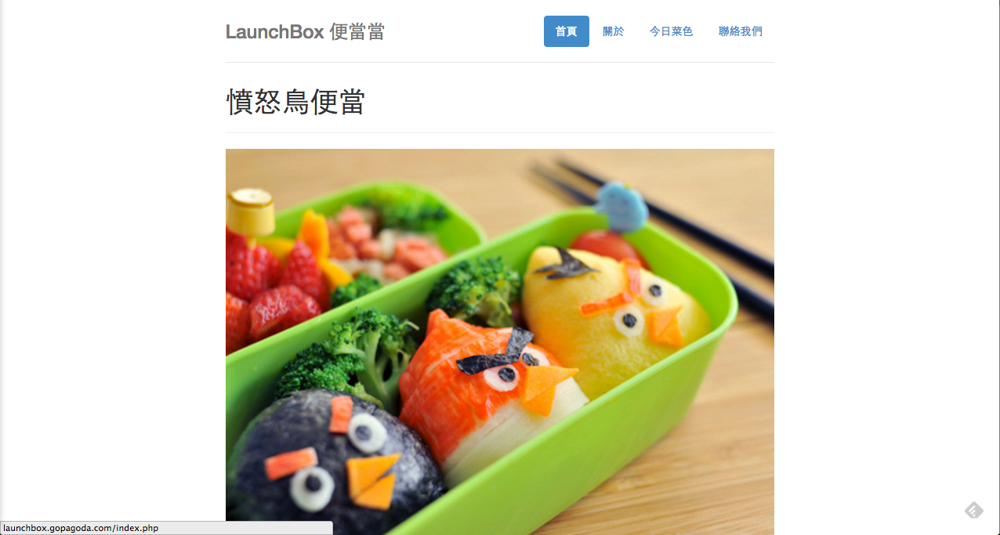
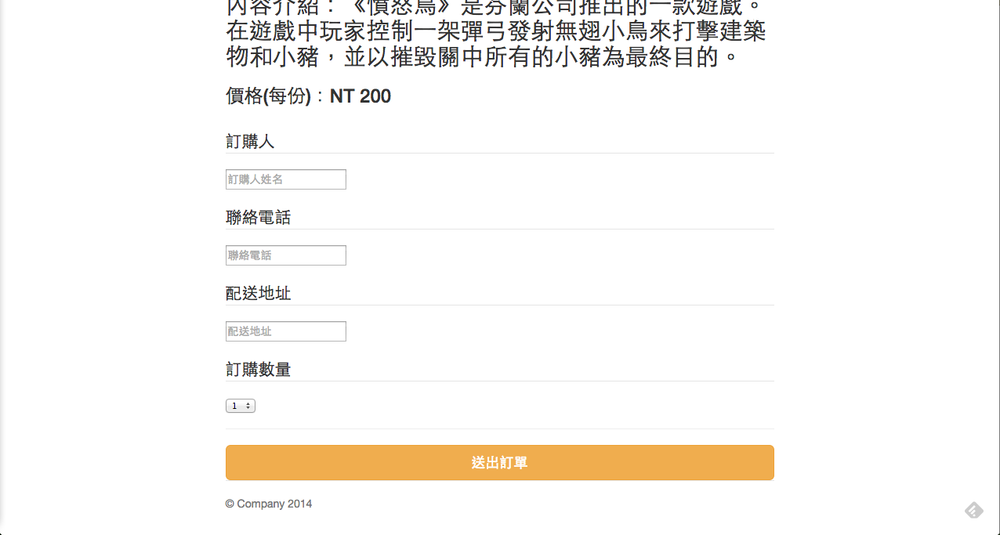
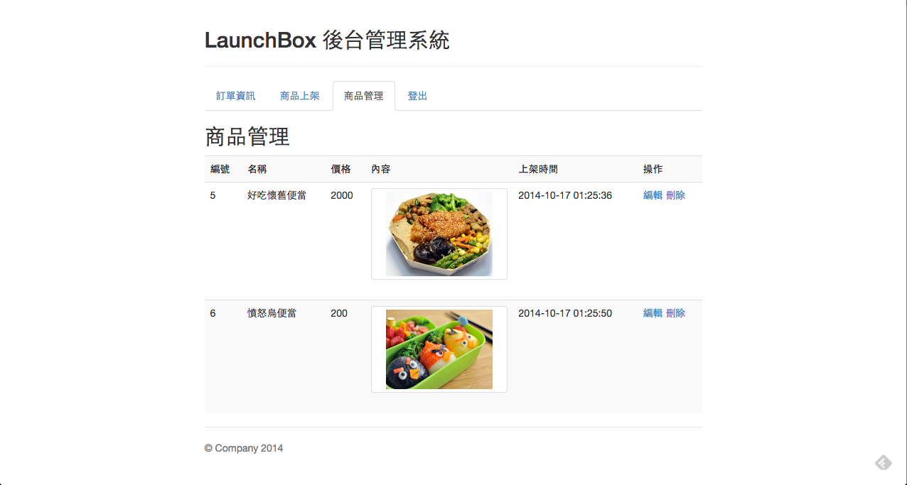

# LaunchBox Project 
LaunchBox is an online meal reservation system build by PHP & MySQL. This a tutorial for back-end newbie to learn how to build a website with Native PHP. 

This example code implement by KD.Chang(kdchang.cc[at]gmail.com)

## Install
1. use git
	```
	git clone https://github.com/kdchang/LaunchBox.git
	```

2. download zip

## Usage
1. open your server (WAMP/XAMPP/MAMP/LAMP).
2. localhost:port (move the project file to the server folder).

## Deploy
1. Git
	1. Sign up in [Pagodabox](https://pagodabox.com/).
	2. Choose the empty repo and give the project name. 
	3. turn on your terminal and move to your project.
	```
	git init 
	```
	```
	git add .
	```
	```
	git commit -m "first commit"
	```
	```
	git push pagoda —all
	```
	* login admin.php can upload the assets/images/rail_lunch.jpg and angry_bird.jpg

2. SFTP
	1. Check SFTP id / password / port / server.
	2. Fill in the Filezilla and connect to the server.
	3. Drag the file to the Code folder.
	* login admin.php can upload the assets/images/rail_lunch.jpg and angry_bird.jpg

=====

-----

-----

-----

-----
## Site Link 
-----
http://launchbox.gopagoda.com/
## Image via 
-----
1. https://www.iconfinder.com/icons/40917/
2. http://www.lagogarden.com/
3. https://dbjdsnch130xu.cloudfront.net/
4. http://www.railway.gov.tw/